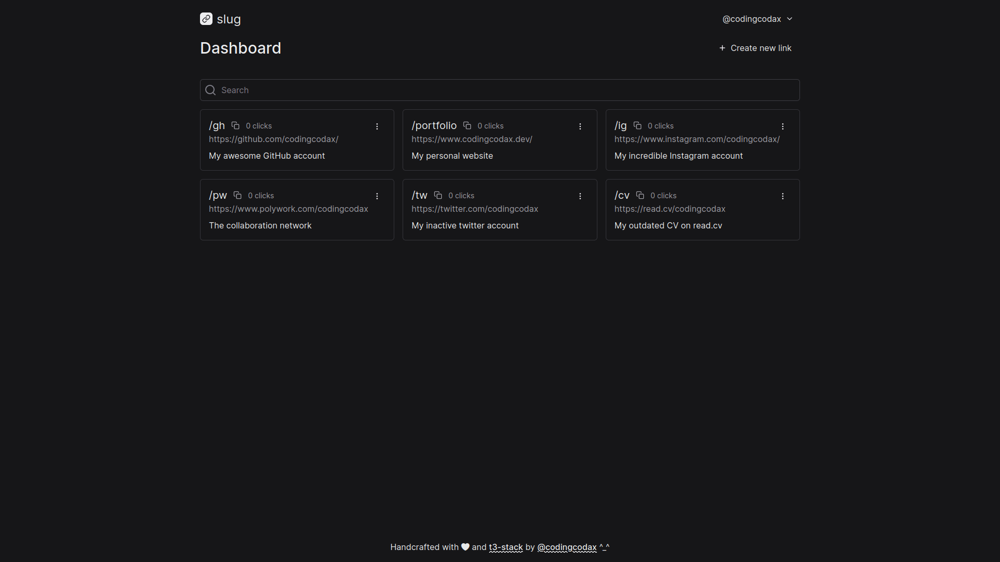

  

  <h3 align='center'>Slug | URL shortener</h3>

  

    <samp>Short your links easy with our link management platform for developers.</samp>
     
    <a href='https://slug.codingcodax.dev/' rel='noopener noreferrer' target='_blank'><strong>Shorten your links</strong></a>
     
     
    <a href='https://github.com/codingcodax/slug/issues/'>Feature Request</a>
    ·
    <a href='https://github.com/codingcodax/slug/issues/'>Bug Report</a>
  

## Preview

## Features

- Easy to use.
- Responsive
- Dark mode

### Techstack

This app was built with the T3 Stack:
- [Next.js](https://nextjs.org)
- [tRPC](https://trpc.io)
- [Tailwind CSS](https://tailwindcss.com)
- [TypeScript](https://typescriptlang.org)
- [Prisma](https://prisma.io)
- [NextAuth.js](https://next-auth.js.org)

## License

Licensed under the [MIT license](./LICENSE.md)
